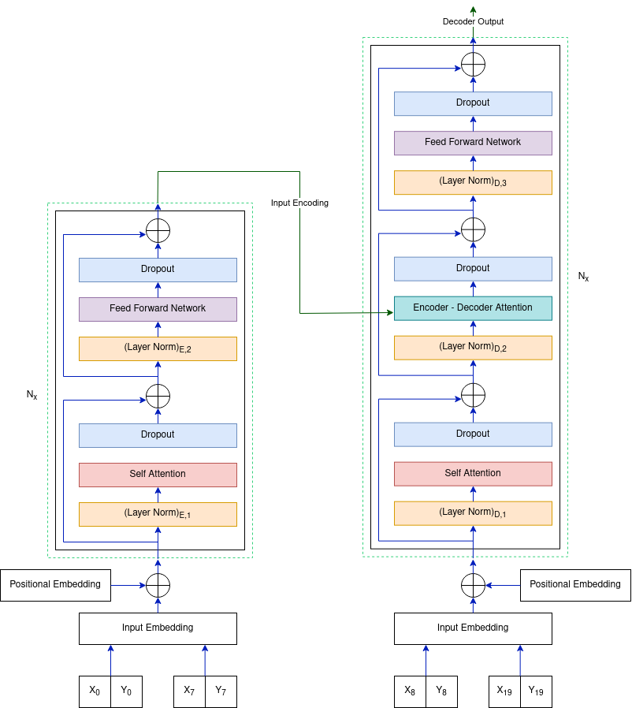

# Human Trajectory Prediction using Transformers
Human trajectory prediction is a key module for any autonomously navigating system and its applications cover a
wide range from mobile robot navigation, including autonomous driving, smart video surveillance to object tracking.
The ability to predict the future movement of humans using their past status can be used to avoid collisions and plan
safer paths for an autonomous vehicle. Transformer networks are widely used for Natural Language Processing to
model word sequences. In this project, we use transformers for the unique purpose of observing the movement of
humans and forecasting their future steps.

## Overview
We implement the classical attention-based Transformer Network (TF) to predict the future trajectories of individuals in a scene. The project is inspired by the paper ["Transformer Networks for Trajectory Forecasting"](https://arxiv.org/abs/2003.08111). We build our model using different optimizer and scheduler techniques and analyze the one that gives us the best performance. We then perform extensive testing using the best model and present some quantitative and qualitative results. The results show that our best TF model is able to predict future pedestrian trajectories with an average error of ~45 cm.

 

   
 

## Dataset
We used the TrajNet dataset which is a superset of diverse datasets. Training on this dataset ensures that our model generalizes and performs well in unseen situations. The directory "dataset" contains all the data from TrajNet. Place the dataset folder in the working directory.

## Running the Training and Evaluation Loop
1. Create a \models folder in the working directory.
2. Execute the train.py script. 

   or

   Run the trajectory-prediction.ipynb notebook.

The script/notebook will train the transformer model while performing validation after every epoch. It will save all the plots from the training and validation in the current working directory. This script also performs trajectory predictions after the model has been trained and saves the prediction plots.

## Implementation Details
The TF implementation uses dmodel = 512, 6 layers and 8 attention heads. The network is trained using an Adam optimizer with a cosine learning rate scheduler. We use an L2 loss between the predicted and target pedestrian trajectories. The dropout probability is 0.1.

## Results
1. <ins>__Quantitative Results:__</ins>
The model gave us a Mean Average Displacement (MAD) Error of ~45 cm and Final Average Displacement (FAD) Error of ~1 m. 

    
    
     
  
 

2. <ins>__Qualitative Results:__</ins>  
To further motivate the quantitative results presented above, we plot the predictions from the Transformer model along with the ground truth for a few randomly selected pedestrians 3. We also plot the observation points that the model uses to make the predictions. The results were quite impressive as we can see that the predictions closely follow the ground truth.

    
    
     
     
  
 
  

